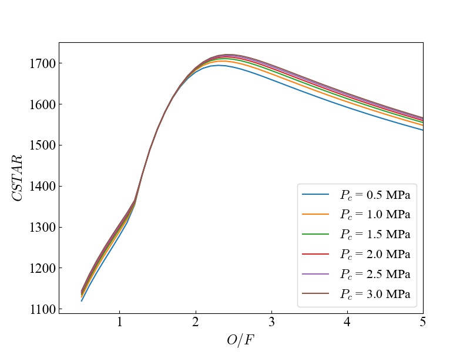

本プログラムは以下の3つで構成される．  
* "cea_pre.py": 計算実行に必要な条件ファイル".inp"を生成する  
* "cea_exe.py": 計算を一斉に実行．".out"ファイルとcsv形式のデータベースファイルを生成する  
* "cea_post.py": データベースを基に，PcとO/Fに対する各パラメータの関係のグラフを生成  

# 1. 計算条件ファイルの生成  
対話形式で計算条件を指定していく  

* "cea_pre.py"を実行  

* 言語の選択　jp=日本語，en=英語

~~~
Please select language.
['jp', 'en']
>> jp
~~~

* 平衡計算条件の指定．（０ or 1 or 2 を入力）
~~~
計算オプション(0~2)を選択してください．
例: 0: 全域平衡計算
    1: 燃焼器内のみ平衡計算
    2: スロートまで平衡計算
>> 0
~~~

* 酸化剤の種類を指定　(NASA-CEAの熱物性ライブラリを使用する場合はRP-1311に準拠した書式で物質記号を入力．使用しない場合は任意の文字を入力)
~~~
酸化剤の種類を入力してください.
*記号はNASA RP-1311-P2 app.B に準拠
例: O2(L)
>> H2O2(L)
~~~  

* 酸化剤の質量分率を指定　(異種混合の場合であれば100%以下の分率を入力)
~~~
酸化剤の質量分率[%]を入力してください
>> 80
~~~  

* 酸化剤の初期温度を入力
~~~
酸化剤の初期温度[K]を入力してください
>> 290
~~~

* 標準生成エンタルピと構成元素を手動入力するか選択する　(NASA-CEAの熱物性ライブラリにない酸化剤を指定した場合に"y", それ以外は"n")  
~~~  
標準生成エンタルピと構成元素を手動入力しますか? "y/n"
>> n
~~~  

* 化学種の入力を続けるか選択　（異種混合酸化剤の場合2種目以降の物質を指定するため"y", すべての物質の指定が完了している場合は"n"）
~~~  
化学種の入力を続けますか? "y/n"
>> y
~~~  

* 同様に2種目の物質を指定し，完了する．  
~~~  
酸化剤の種類を入力してください.
*記号はNASA RP-1311-P2 app.B に準拠
例: O2(L)
>> H2O(L)

酸化剤の質量分率[%]を入力してください
>> 20

酸化剤の初期温度[K]を入力してください
>> 290

標準生成エンタルピと構成元素を手動入力しますか? "y/n"
>> n

化学種の入力を続けますか? "y/n"
>> n
~~~  

* 入力内容を確認する　(間違っていれば"n"選択後，最初からやり直す)
~~~  
入力した内容は正確ですか? "y/n"
[{'name': 'H2O2(L)', 'wt': 80.0, 'temp': 290.0, 'h': '', 'elem': ''}, {'name': 'H2O(L)', 'wt': 20.0, 'temp': 290.0, 'h': '', 'elem': ''}]
>> y
~~~  

* 燃料の種類を指定する　(NASA-CEAの熱物性ライブラリを使用する場合はRP-1311に準拠した書式で物質記号を入力．使用しない場合は任意の文字を入力)  
~~~  
燃料の名前を入力してください
例: PMMA
>> PE
~~~  

* 燃料の質量分率を指定する  
~~~  
燃料の質量分率[%]を入力してください
>> 100
~~~  

* 燃料の初期温度を指定する  
~~~
燃料の初期温度[K]を入力してください
>> 300
~~~

* 標準生成エンタルピと構成元素を手動入力するか選択する　(NASA-CEAの熱物性ライブラリにない燃料を指定した場合に"y", それ以外は"n") 
~~~
標準生成エンタルピと構成元素を手動入力しますか? "y/n"
>> y
~~~

* 燃料の標準生成エンタルピを入力
~~~
燃料の標準生成エンタルピ[kJ/mol]を入力してください
>> -54.3
~~~

* 1 mol 燃料中の元素とそのmol数を入力　※各文字間には半角スペースをいれる
~~~
1molの燃料に含まれる元素とそのmol数(整数)を入力してください.
例: C 5 H 2 O 6
>> C 2 H 4
~~~

* 化学種の入力を続けるか選択　（異種混合燃料の場合2種目以降の物質を指定するため"y", すべての物質の指定が完了している場合は"n"）
~~~  
化学種の入力を続けますか? "y/n"
>> n
~~~  

* 入力内容を確認する　(間違っていれば"n"選択後，最初からやり直す)
~~~  
入力した内容は正確ですか? "y/n"
[{'name': 'PE', 'wt': 100.0, 'temp': 300.0, 'h': -54.3, 'elem': 'C 2 H 4'}]
>> y
~~~  

* ノズル開口比を入れる　※わからなければ1.0
~~~
開口比Ae/Atを入力してください.
>> 2.0
~~~

* 計算したいO/F の範囲を入力　※各数値間には半角スペースをいれる
~~~
計算するO/Fの範囲を入力してください.
許容範囲：0.01~99.99 , 最小刻み幅：0.01
例) 0.5~10 を 0.1毎に計算する場合.
0.5　10.1　0.1
>> 0.5 5.5 0.5
~~~

* 計算したい燃焼室圧力の範囲を入力　※各数値間には半角スペースをいれる
~~~
計算する燃焼室圧力[MPa]の範囲を入力してください.
許容範囲：0.2~100 MPa, 最小刻み幅：0.01　MPa
例) 0.5~5.0 MPa を 0.1 MPa毎に計算する場合.
0.5　5.1　0.1
>> 1.0 5.0 1.0
~~~

* 計算条件ファイル群出力時の格納フォルダ名を入力
~~~
Input a Case Name (Folder Name) >>
>> test
100%|██████████████
~~~

* プログレスバーが100%になって完了すれば，cea_dbフォルダ下に(今回は)`test`が生成される．当該フォルダに.inpファイル群を格納したフォルダ`inp` が生成されているはずである．  
> cea_pre.py  
> ...  
> cea_db/  
> 　　├ test/  
> 　　　　├ inp/  
> 　　　　　　├ Pc_01.00__of_00.50.inp  
> 　　　　　　　...  

生成された.inpファイル一つ一つが指定した燃焼室圧力，およびO/Fの計算条件に該当し，ファイル名がそれを示している．

# 2. CEAの実行
* `cea_exe.py` を実行

* 先程生成したフォルダ名を入力
~~~
Input Folder Name (e.g. "O2+PMMA")
>>test
100%|██████████████
~~~

* 100%になって完了すれば，指定したフォルダ (今回は `test` ) 中のフォルダ `out`に各計算条件毎のCEA出力(.out)ファイルが，`csv_database` に各パラメタ毎のcsvファイル，更には`MoleFraction@***`に各燃焼生成物のモル分率のcsvファイルが生成されているはず  
※csvファルは，縦軸O/F,横軸Pc(燃焼室圧力[MPa])  
> cea_pre.py  
> ...  
> cea_db/  
> 　　├ test/  
> 　　　　├ inp  
> 　　　　├ out/  
> 　　　　 |　  ├ Pc_01.00__of_00.50.out  
> 　　　　 |　┗　  ...  
> 　　　　├　csv_database/  
> 　　　　　　  ├ MoleFraction@Chamber/  
> 　　　　　　　　　  ├ C(gr).csv  
> 　　　　　　　　　  　　....  
> 　　　　　　  ├ MoleFraction@Throat  
> 　　　　　　  ├ MoleFraction@Exit  
> 　　　　　　  ├ CF.csv  
> 　　　　　　  ├ CONDUCTIVITY_c.csv  
> 　　　　　　  ├ CONDUCTIVITY_e.csv  
> 　　　　　　　  ...  
  
**ロケットパラメタ一覧**

| Symbol | Parameter |
|:---|:---|
|CSTAR |c* 効率 |
|CF |推力係数 |
|Isp |比推力(最適膨張) [s] |
|Ivac |真空中比推力 [s] |
  
**熱力学的パラメタ一覧**

| Symbol | Parameter |
|:---|:---|
|Cp |定圧比熱 [kJ/kg-K] |
|G |ギブス自由エネルギ [kJ/kg] |
|GAMMAs |比熱比 |
|H |エンタルピ [kJ/kg] |
|M |分子量 |
|MACH |マッハ数 |
|P |圧力 [MPa] |
|RHO |密度 [kg/m^3] |
|S |エントロピ [kJ/kg-K] |
|SON |音速 [m/s] |
|T |温度 [K] |
|U |内部エネルギ [ｋJ/kg] |

**熱輸送関係のパラメタ一覧**

| Symbol | Parameter |
|:---|:---|
|VISC |粘性係数 [mP] |
|CONDUCTIVITY |熱伝導率 [mW/cm-K] |
|PLANDTL |プラントル数 [-] |

※frozen 条件で計算した**熱伝導率**と**プラントル数**は反応による生成物の影響を考慮していないため低い値が得られる。正しく計算したい場合はequilibrium条件で計算しなければいけない。

**ファイル名末尾の添字一覧**

| Symbol | Subscription |
|:---|:---|
|_c |燃焼室後方における計算結果 |
|_t |ノズルスロートにおける計算結果 |
|_e |ノズル出口における計算結果 |

# 3. 計算結果の描画
データベースを基に，補間した各パラメータに関してPcとO/Fに対する関係をグラフとして描画，画像ファイルを出力する．  

* 先程生成したフォルダ名を入力
~~~
Input Folder Name (e.g. "O2+PMMA")
>>test
~~~  

* グラフを描画したいパラメータのデータベースファイル(.csv)名を入力する (生成物のモル分率の場合親フォルダを含めたディレクトリ構造を入力．例）>> MoleFraction@Chamber/H2O )
~~~  
Input parameter name (That is same as csv file name.)
>> CSTAR
~~~  

* 描画するO/Fの範囲を入力する． (データベースのO/Fの条件が4つ以上ないとエラーが出る)  
~~~  
Please input the range of O/F where you want to plot.
e.g. If the range is 0.5 to 5.0
0.5 5.0
>> 0.5 5.0
~~~  
  
* 描画するPcの範囲と間隔を入力する．(データベースのPcの条件が4つ以上ないとエラーが出る)  
~~~  
Please input the range of Pc where you want to plot.
Range: 0.2 ~ 99.99, Minimum interval: 00.1 MPa
e.g. If the range is 0.5 to 5.1 MPa and the interval is 0.1 MPa
0.5 5.0 0.1
>> 1.0 4.0 1.0
~~~   

* 指定したパラメータのデータファイルが存在するディレクトリ上に.jpg形式のグラフが出力される．  
> cea_pre.py  
> ...  
> cea_db/  
> 　　├ test/  
> 　　　　├ inp  
> 　　　　├ out/  
> 　　　　├　csv_database/  
> 　　　　　　  ├ CSTAR.csv  
> 　　　　　　  ├ CSTAR.jpg  
> 　　　　　　　  ...  

ファイルの中身  
